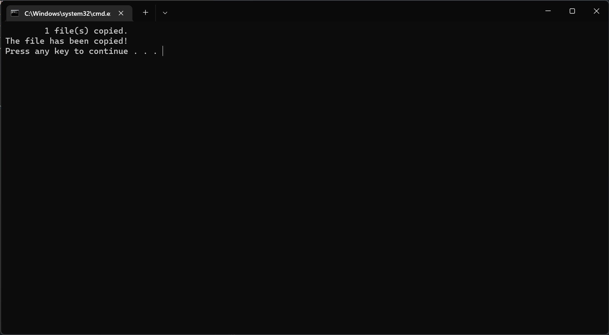

# Дослідження командного середовища Microsoft Windows

## Мета роботи

Дослідити основні команди консолі Microsoft Windows, створити пакетний файл, який повинен виконувати функції автоматизації деяких процесів у командному середовищі операційної системи Microsoft Windows.

## Завдання до роботи

- Використовуючи методичні вказівки до виконання практичних робіт і глобальну мережу Інтернет, вивчити основні команди консолі. Детально описати характеристики та призначення восьми команд за вибором зі списку:
  - CLS
  - COPY
  - DIR
  - ECHO
  - GOTO
  - EXIT
  - IF
  - MD
- Власноруч створити пакетний командний файл `*.bat`, який має цікаве та корисне призначення. Відобразити результати виконання цього файлу

## Результати виконання роботи

### Опис команд

- CLS: Ця команда використовується для очищення екрана консолі. Вона не потребує жодних аргументів і просто видаляє весь текст з вікна консолі.
- COPY: Ця команда використовується для копіювання файлів з одного місця в інше. Їй потрібні два аргументи: файл-джерело і місце призначення.
- DIR: Ця команда використовується для відображення списку файлів і підкаталогів у каталозі. Вона може приймати різні перемикачі для зміни виводу, наприклад, /w для широкого формату виводу або /p для паузи після кожного виводу на екран.
- ECHO: Ця команда використовується для виведення повідомлення на екран або для увімкнення чи вимкнення відлуння команд у командному файлі. Наприклад, ECHO Hello, World! виведе на консоль повідомлення "Hello, World!".
- GOTO: Ця команда використовується у командних файлах, щоб спрямувати командний процесор на позначений рядок скрипта. Наприклад, GOTO END призведе до переходу на рядок з міткою :END.
- EXIT: Ця команда використовується для завершення сеансу командного процесора, закриття скрипта або пакетного файлу.
- IF: Ця команда використовується для виконання умовної обробки в пакетних файлах. Наприклад, IF EXIST ім'я файлу (DEL ім'я файлу) видалить вказаний файл, якщо він існує.
- MD: Ця команда використовується для створення каталогу. Наприклад, MD new_directory створить новий каталог з назвою "new_directory".

### Розробка пакетного файлу

```bat
@ECHO OFF
MD newLocation
COPY main.bat newLocation
ECHO The file has been copied!
PAUSE
```

#### Результати виконання



## Висновки

Таким чином, ми дослідили основні команди консолі Microsoft Windows, а також створили пакетний файл, який виконав функції автоматизації деяких процесів у командному середовищі операційної системи Microsoft Windows.

### Контрольні питання

#### Яке призначення мають консольні команди?

Консольні команди, також відомі як інструкції командного рядка, в основному використовуються для взаємодії з операційною системою комп'ютера. Вони дають змогу користувачам безпосередньо вказувати комп'ютеру виконувати певні завдання, наприклад, керувати файлами та каталогами, запускати програми або отримувати доступ до мережевих ресурсів. Консольні команди часто потужніші та гнучкіші, ніж графічні інтерфейси користувача, що дозволяє виконувати складні операції та писати сценарії.

#### У яких випадках застосовуються команди консолі?

Консольні команди використовуються в різних ситуаціях. Системні адміністратори часто використовують їх для таких завдань, як обслуговування системи, автоматизація повторюваних завдань та усунення несправностей. Розробники використовують консольні команди для виконання завдань програмування, таких як компіляція та запуск програм, керування системами контролю версій та взаємодія з базами даних. Консольні команди також використовуються, коли графічний інтерфейс користувача недоступний, наприклад, на віддаленому сервері або при мінімальній інсталяції операційної системи.

#### Яким чином створюється пакетний командний файл?

Пакетний командний файл, також відомий як пакетний скрипт, - це текстовий файл, який містить серію консольних команд. Щоб створити пакетний командний файл, спочатку відкрийте текстовий редактор, а потім напишіть команди, які ви хочете виконати, кожну з нового рядка. Після того, як ви напишете всі команди, ви зберігаєте файл з розширенням .bat (у Windows). Коли цей файл запускається, команди виконуються в тому порядку, в якому вони з'являються у файлі. Це особливо корисно для автоматизації завдань, що повторюються.
