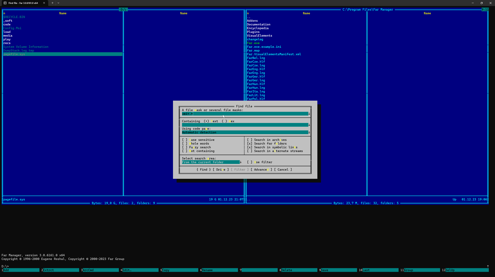
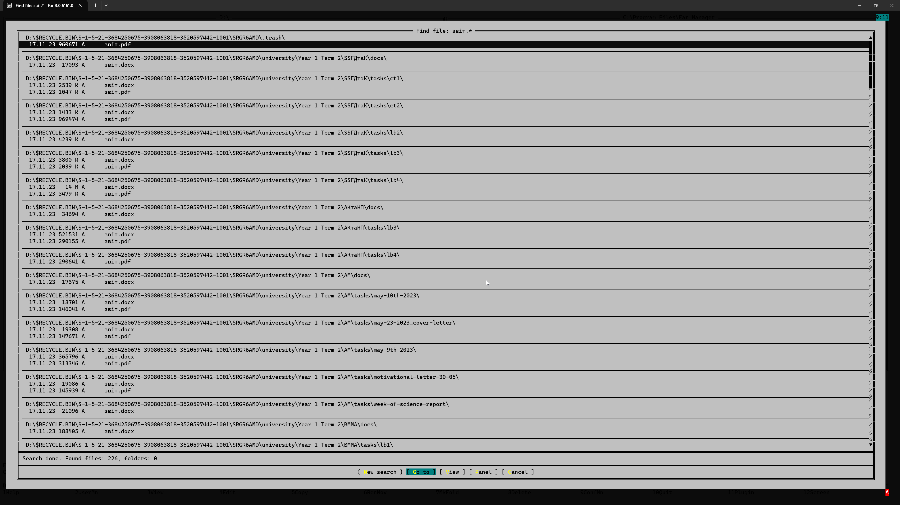
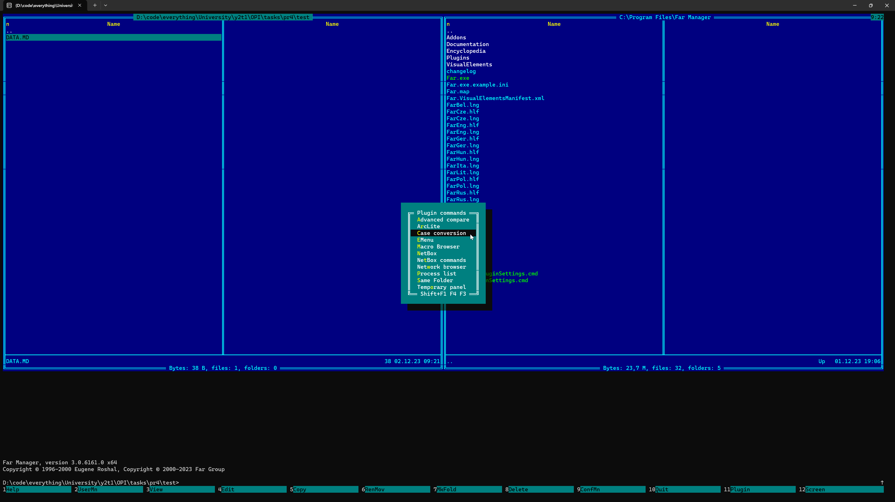
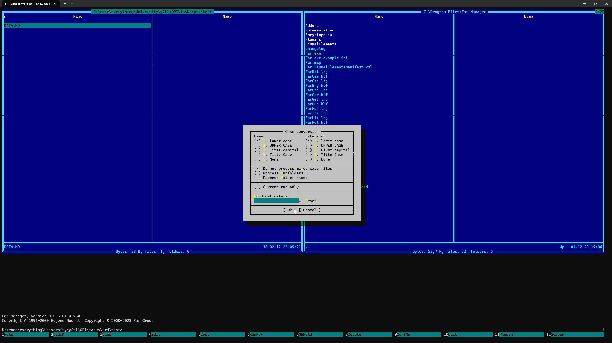
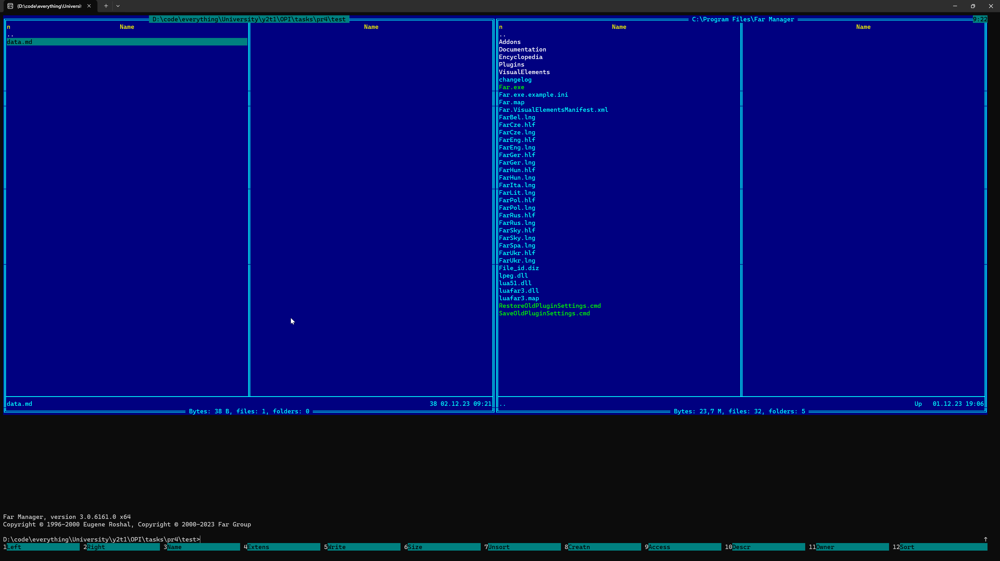

# Файлові менеджери

## Мета роботи

Дослідити найпоширеніші файлові менеджери, вивчити загальні клавіатурні комбінації, відпрацювати основні команди, включно з роширеним пошуком файлів.

## Завдання до роботи

- Встановити три нижчезазначені файлові менеджери
  - FAR
  - Midnight Commander
  - Total Commander
- Вивчити принципи роботи файлових менеджерів Total Commander, Midnight Commander, Far Manager
- Дослідити можливості найбільш розповсюджених плагінів та різноманітні варіанти розширеного пошуку файлів і даних. Навести результати дослідження як скрін-копії екрану.
- Проаналізувати загальні риси та відмінності цих файлових менеджерів. Аналіз можливостей, загальних рис та відмінностей звести у єдину таблицю. Недоліки та переваги вказати окремо для кожного файлового менеджера
- Для кожного файлового менеджера вивчити гарячі клавіші та створити відповідні довідкові таблиці. Виокремити такі комбінації клавіш, що повторюються між всіма

## Результати виконання роботи

### Вивчення принципів роботи файлових менеджерів

Кожен файловий менеджер має свої унікальні можливості та користувацький інтерфейс. Розглянемо кожен з них докладніше:

- **Midnight Commander**: Це візуальний файловий менеджер з двопанельним інтерфейсом. Він підтримує комбінації клавіш для таких операцій з файлами, як копіювання, переміщення та видалення. Наприклад, щоб видалити файл, потрібно виділити його і натиснути клавішу `F8`. Для копіювання файлів можна використовувати клавішу `F5`.
- **Total Commander**: Це потужний файловий менеджер, який підтримує плагіни для стиснення, файлової системи і типів файлів. Він пропонує двопанельний макет для зручної роботи з файлами. Total Commander також має ефективну функцію пошуку файлів, яка дозволяє використовувати регулярні вирази для пошуку імен файлів або навіть всередині вмісту файлів. Він може фільтрувати файли за розміром, датою та іншими параметрами, або навіть знаходити дублікати файлів.
- **FAR Manager**: Це текстовий файловий менеджер, який підтримує роботу з клавіатурою. Всі дії легко доступні за допомогою комбінацій клавіш, і можна швидко записати макроси для будь-якої повторюваної дії. FAR Manager також підтримує багато плагінів і має функцію контекстної допомоги в автономному режимі.

### Дослідження можливостей

#### FAR Manager

##### Розширений пошук

Для виконання розширеного пошуку файлів або даних у FAR Manager можна виконати наступні кроки:

1. Відкрийте FAR Manager
2. Натисніть комбінацію клавіш Alt+F7, щоб відкрити діалогове вікно пошуку
3. У полі "Шукати" ви можете ввести назву файлу, який ви шукаєте. Якщо ви не впевнені в точності назви, ви можете використовувати символи підстановки (`*`) для позначення довільної кількості символів. Наприклад, якщо ви шукаєте файл `.txt`, ви можете ввести `*.txt`, щоб знайти всі текстові файли.
4. У полі "Шукати в" ви можете вказати каталоги, з яких ви хочете почати пошук. Ви можете вказати декілька каталогів, розділених крапкою з комою (`;`).
5. У полі "Шукати за маскою" ви можете вказати типи файлів, які вас цікавлять. Наприклад, якщо ви шукаєте файли `.txt` і `.doc`, ви можете ввести `*.txt;*.doc`.
6. У діалоговому вікні ви також можете вказати інші параметри пошуку, наприклад, пошук у підкаталогах, пошук файлів з певними атрибутами (наприклад, лише для читання або прихованих) тощо.
7. Після введення критеріїв пошуку натисніть кнопку "Шукати", щоб розпочати пошук.
8. FAR Manager відобразить список файлів, які відповідають вашим критеріям пошуку. Ви можете переміщатися по цьому списку за допомогою клавіш зі стрілками і натискати клавішу `Enter`, щоб відкрити файл.
9. Якщо ви хочете зупинити пошук у будь-який момент, ви можете натиснути `Esc`, щоб закрити діалогове вікно пошуку.

Приклади використання функції пошуку у FAR Manager наведені нижче у вигляді знімків екрана.

##### Можливості підтримки плігінів

FAR Manager пропонує безліч попередньо встановлених плагінів для зручності користувачів. Для цієї демонстрації ми зосередимося на плагіні Case Conversion.

Щоб отримати доступ до цього плагіна, просто натисніть `F11` на клавіатурі. На екрані з'являться всі доступні плагіни.

Щоб скористатися плагіном Case Conversion, спочатку виберіть файл у вашій системі. Для цього прикладу припустимо, що у нас є файл з назвою `DATA.MD` у тестовому каталозі.

Вибравши файл, натисніть `F11` ще раз і виберіть плагін Case Conversion. У цьому випадку ми перетворимо ім'я та розширення файлу на малі літери.

Після того, як ви зробите вибір і натиснете `OK`, ім'я файлу буде успішно перетворено до нижнього регістру.

Для більш детальної демонстрації використання цього плагіна, будь ласка, зверніться до розділу нижче, де наведено скріншоти.

#### Midnight Commander

##### Розширений пошук

Приклади використання функції пошуку у Midnight Commander наведені нижче у вигляді знімків екрана.

##### Можливості підтримки плігінів

#### Total Commander

##### Розширений пошук

Приклади використання функції пошуку у Total Commander наведені нижче у вигляді знімків екрана.

##### Можливості підтримки плігінів

## Висновки

Таким чином, ми дослідили найпоширеніші файлові менеджери, вивчили загальні клавіатурні комбінації, а також відпрацювали основні команди, включно з роширеним пошуком файлів.

## Контрольні питання

### Розширене значення терміну - Файловий Менеджер

Файловий менеджер - це програмне забезпечення, яке надає зручний інтерфейс для організації, управління та маніпулювання файлами, що зберігаються в системі зберігання даних на комп'ютері. Він дозволяє користувачам виконувати різні операції, такі як створення, відкриття, перейменування, переміщення, копіювання, видалення файлів та керування каталогами. Файлові менеджери часто надають додаткові функції, такі як пошук файлів, попередній перегляд файлів та інтеграція з іншим програмним забезпеченням.

### Які основні функції та призначення файлових менеджерів?

Основні функції файлових менеджерів включають керування файлами та каталогами, що передбачає їх створення, видалення, переміщення та перейменування. Вони також дозволяють користувачам переглядати властивості файлів і відкривати їх за допомогою відповідних програм. Файлові менеджери часто надають розширені можливості, такі як пошук, сортування, фільтрація та створення закладок. Мета файлового менеджера - надати користувачеві зручний інтерфейс для керування файлами, щоб полегшити користувачам організацію файлів і каталогів та маніпулювання ними.

### Які файлові менеджери Вам відомі?

Існує безліч файлових менеджерів, кожен з яких має свої унікальні функції та можливості. Деякі з найпопулярніших включають Провідник Windows (також відомий як Провідник файлів у нових версіях Windows), Finder на macOS та Nautilus (також відомий як Файли) у дистрибутивах Linux на основі GNOME. Серед інших відомих файлових менеджерів - Midnight Commander, Total Commander і Far Manager, які часто використовуються у професійних і вимогливих до ресурсів середовищах завдяки їхнім розширеним можливостям і гнучкості.
