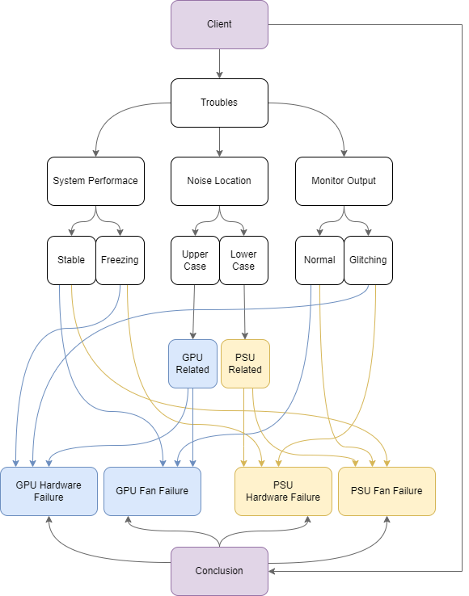

- [x] визначити предметну область
  > "Діагностика несправностей комп'ютерів"
- [x] побудувати словник предметної області
- [x] намалювати семантичну мережу
- [ ] розробити програму на SNToolbox у MATLAB
- [ ] зробити запит до семантичної мережі

#### Контрольні питання

##### Поняття інтелектуальної системи

Інтелектуальна система - це така система, яка передбачає відсутність чіткого алгоритму для вирішення поставленої задачі, а натомість використовує бази знань для розв'язання задач.

##### Властивості інтелектуальних систем

##### Характеристика систем, заснованих на знаннях

##### Архітектура експертної системи

##### Поняття знання

##### Відміна знань від даних

##### Поняття екстенсіоналу та інтенсіоналу

##### Загальні відомості про моделі представлення знань

##### Поняття семантичної мережі

##### Формалізація семантичної мережі

##### Прості та ієрархічні мережі

##### Основні типи об'єктів та зв'язків між ними

##### Види семантичних відношень

##### Модифікація баз знань на семантичних мережах

##### Операція порівняння із зразком

##### Яким чином виконується подання знань в семантичній моделі?

##### Для чого використовується операція порівняння із зразком в семантичній мережі?

##### Принципи наслідування інформації в мережній моделі?

##### Які основні типи об'єктів і відношень між ними в семантичній мережі є обов'язковими?

##### Як здійснюється пошук інформації в мережній базі знань?

##### Назвіть переваги та недоліки семантичної мережі

##### За допомогою яких відношень в мережі можна виразити ієрархію об'єктів?

##### Однорідна та неоднорідна мережа, дискретна мережа. Що їх відрізняє?

##### Що зветься сценарієм?

##### За заданим висловом виділіть об'єкти-поняття (концепти), об'єкти-події, об'єкти-характеристики

##### Бібліотека SNToolbox для моделювання семантичних мереж у пакеті MATLAB

#### Словник предметної області

| Event Name           | Entity Description                                                                                   | Attribute Name                                     | Attribute Valid Values                                      |
| -------------------- | ---------------------------------------------------------------------------------------------------- | -------------------------------------------------- | ----------------------------------------------------------- |
| Client               | A person who is having troubles with their PC hardware.                                              | Troubles, Conclusion                               |                                                             |
| Troubles             | A description of client's problem                                                                    | System Performance, Noise Location, Monitor Output | Stable, Freezing; Upper Case, Lower Case; Normal, Glitching |
| System Performance   | The client's system performance, measured as their subjective experience of working with the system. | Stable, Freezing                                   |                                                             |
| Stable               | System performance that seems stable to the user                                                     |                                                    |                                                             |
| Freezing             | System performance that works unstable - with freezing, be it constant or periodic                   |                                                    |                                                             |
| Noise Location       | The location of the noise that the user hears in the system.                                         | Upper Case, Lower Case                             |                                                             |
| Upper Case           | Strange noise that comes from somewhere around the upper part of computer case                       |                                                    |                                                             |
| Lower Case           | Strange noise that comes from somewhere around the lower part of computer case                       |                                                    |                                                             |
| Monitor Output       | Output of user's monitor or any screen they might have connected to the system                       | Normal, Glitching                                  |                                                             |
| Normal               | Monitor output that seems stable to the user - without any artifacts or sudden glitches              |                                                    |                                                             |
| Glitching            | Monitor output that glitches - suddenly shows arbitrary shapes, turns off, freezes, etc.             |                                                    |                                                             |
| GPU Hardware Failure | Computer problem that happens when GPU hardware fails.                                               |                                                    |                                                             |
| GPU Fan Failure      | Computer problem that happens when GPU fan fails.                                                    |                                                    |                                                             |
| PSU Hardware Failure | Computer problem that happens when PSU hardware fails.                                               |                                                    |                                                             |
| PSU Fan Failure      | Computer problem that happens when PSU fan fails.                                                    |                                                    |                                                             |

#### Семантична мережа

Positive Scenario:

- If system performance is stable and noise location is upper case and monitor output is normal, then conclusion is GPU Fan Failure.

Negative Scenario:

- If system performance is freezing and noise location is lower case and monitor output is normal, then conclusion is Unknown.



- Dont turn on
  - PSU failure
- Turn on but no screen
  - GPU failure
- Blue screen
  - OS crash
- Program crash
  - Software App crash
- Program wont open
  - Software App crash
- Program wont update
  - Software App crash
- OS wont update
  - OS crash
- No internet
  - Cable damage
- Making noise
  - Fan failure
- Freezing / Working slow
  - CPU failure
- hardware failure
- software failure

---

```
patient has either symptom or diagnosis.
symptoms splits into three - body temperature, pain place, pain type.
temperature can be either normal or high.
pain place can be either stomach or back.
pain type can be either mild or severe.
if pain place is stomach, diagnosis includes apendicitis.
if pain is in back diagnosis includes piolophrenitus.
if temperature is normal, diagnosis includes chronic apendicitis or chronic piolophrenitus.
if temperature is high, diagnosis includes severe apendicitis or severe piolophrenitus.
if pain is mild, diagnosis includes chronic apendicitis or chronic piolophrenitus.
if pain is severe, diagnosis includes severe apendicitis or severe piolophrenitus.
an arrow goes from patient to diagnosis and then splits into those four types of diagnosis - chronic apendicitis, chronic piolophrenitus, severe apendicitis, severe piolophrenitus.
diagnosises like apendicitis and piolophrenitus split into their specific types.
```

---

client has troubles and problem.
troubles splits into three - does turn on, does make sound, does freeze.
