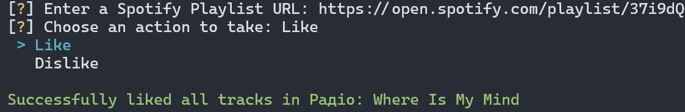

  

<h1 align="center">Spotify Playlist Liker</h1>

### Table of contents

- [Table of contents](#table-of-contents)
- [Installation Instructions](#installation-instructions)
- [Usage Tips](#usage-tips)
- [Screenshots](#screenshots)
- [Links](#links)
- [License](#license)

### Installation Instructions

- Download [latest version](https://github.com/seesmof/spotify-playlist-liker/releases) of the app
  - Make sure you have Python 3.10 or later installed. If not, please do so - [latest version](https://www.python.org/downloads/)
- Unarchive the archive you got
- Open and run `Run.bat` file
- Enjoy!

### Usage Tips

To use this app, you will need to create a Spotify application in `Spotify for Developers`. To do that, please follow the steps below, it is not hard at all.

### Screenshots

### Links

- [Icon](https://www.flaticon.com/)

### License

This project is licensed under the [MIT License](./LICENSE).

<a href="#readme-top"><strong>Back to top</strong></a>

