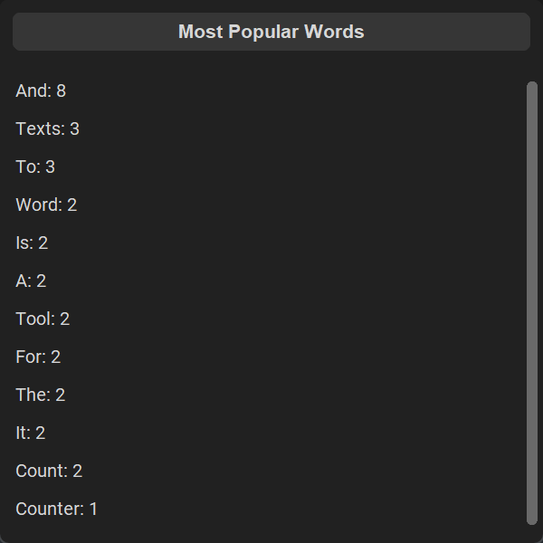

**[Інструкція Українською](./docs/README_Ukrainian.md)**

  

<h1 align="center">Word Counter App</h1>

## Table of contents

- [Table of contents](#table-of-contents)
- [About](#about)
- [How to Use](#how-to-use)
- [Tips and Useful Information](#tips-and-useful-information)
- [Screenshots](#screenshots)
- [Links](#links)
- [License](#license)

## About

Word Counter is a simple and easy-to-use tool for analyzing texts and getting statistics about the number of words and characters they contain. It allows users to load texts from files and calculates various metrics such as word count, character count, and reading time. The app is designed to be straightforward and intuitive, making it a useful tool for writers, students, and anyone who needs to analyze texts quickly and easily.

## How to Use

1. [Download](https://github.com/seesmof/word-counter-app/archive/refs/tags/v1.0.1.zip) the files to your computer
   1. Make sure you have Python 3.10 or higher installed on your computer. If not, please download the latest version of Python from [here](https://www.python.org/downloads/)
2. Unzip the downloaded archive
3. Open app's folder and double-click `Run.vbs` file
4. Enjoy!

## Tips and Useful Information

- Press Escape whenever you want to exit the app
- All the text is UTF-8 encoded so you don't need to worry about special characters
- Your data is automatically saved and loaded on program start and close respectively
- Load your own text files using the `Load from file` button
- See the most frequent words using the `Popular words` button

## Screenshots

## Links

- [Icon](https://www.flaticon.com/)

## License

This project is licensed under the [Apache 2.0 License](./LICENSE).

<a href="#readme-top"><strong>Back to top</strong></a>

